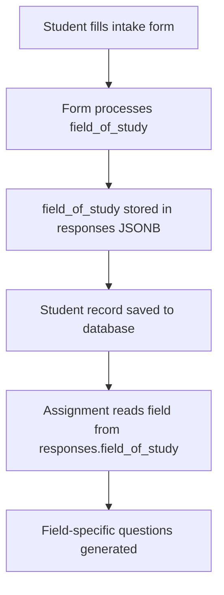

# Database Schema Fix: field_of_study Column Error

## 🚨 Problem Identified

The application was experiencing a 400 Bad Request error when submitting the intake form:

```
POST https://eboqteuzjxsgeilkjzwd.supabase.co/rest/v1/students 400 (Bad Request)
Could not find the 'field_of_study' column of 'students' in the schema cache
```

## 🔍 Root Cause Analysis

The issue was that the frontend code in [`src/pages/Intake.jsx`](src/pages/Intake.jsx) was attempting to save `field_of_study` as a top-level column in the `students` table, but this column does not exist in the actual database schema.

### Database Schema (Actual)
```sql
CREATE TABLE students (
  id UUID PRIMARY KEY DEFAULT gen_random_uuid(),
  user_id TEXT,
  name TEXT,
  email TEXT UNIQUE,
  student_id TEXT UNIQUE,
  grade TEXT,
  tier TEXT CHECK (tier IN ('Seed', 'Tree', 'Sky')),
  responses JSONB DEFAULT '{}'::jsonb,  -- ✅ This is where field_of_study should be stored
  is_active BOOLEAN DEFAULT TRUE,
  created_at TIMESTAMPTZ DEFAULT NOW(),
  updated_at TIMESTAMPTZ DEFAULT NOW()
);
```

### Frontend Code (Previous - Incorrect)
```javascript
const payload = {
  user_id: user.id,
  name: form.name || null,
  email: form.email || null,
  student_id: isEditing ? undefined : generateStudentId(),
  grade: form.education_level || null,
  field_of_study: form.field_of_study || responses.field_of_study || null, // ❌ This column doesn't exist
  tier: null,
  responses,
  updated_at: new Date().toISOString(),
};
```

## ✅ Solution Applied

Removed the `field_of_study` from the top-level payload. The data should only be stored within the `responses` JSONB field:

### Frontend Code (Fixed)
```javascript
const payload = {
  user_id: user.id,
  name: form.name || null,
  email: form.email || null,
  student_id: isEditing ? undefined : generateStudentId(),
  grade: form.education_level || null,
  tier: null,
  responses, // ✅ field_of_study is stored within this JSONB object
  updated_at: new Date().toISOString(),
};
```

## 🔧 Changes Made

### File: `src/pages/Intake.jsx`
1. **Line 284**: Removed `field_of_study: form.field_of_study || responses.field_of_study || null,` from payload
2. **Line 287**: Updated console log to reflect the new structure

## 🧪 How to Test the Fix

### 1. Test Intake Form Submission
1. Start the application: `npm run dev`
2. Navigate to `/intake`
3. Fill out the form with field of study selection
4. Submit the form
5. **Expected Result**: No 400 error, successful submission

### 2. Verify Data Storage
1. Check the browser console for successful submission logs
2. In Supabase dashboard, verify the `students` table shows:
   - New record created successfully
   - `responses` column contains `field_of_study` data
   - No attempt to save to non-existent `field_of_study` column

### 3. Test Field-Based Assignments
1. After successful intake submission
2. Navigate to `/assignment`
3. **Expected Result**: Assignment should detect field from `responses.field_of_study`

## 📊 Data Flow (Corrected)



## 🚀 Verification Commands

```bash
# Start development server
npm run dev

# Open browser to test
# http://localhost:5174/intake
```

## 📝 Console Logs to Watch For

### Successful Submission:
```
💾 Processed form responses: {...}
🎯 Field of study selection: stem
🚀 Final payload (field_of_study stored in responses): {...}
Database operation successful
```

### No More Errors:
- ❌ `Could not find the 'field_of_study' column`
- ✅ Successful 200/201 responses from Supabase

## 🔄 Related Components

This fix ensures consistency across all components that access field_of_study:

1. **`src/pages/Intake.jsx`** ✅ Fixed - stores in responses only
2. **`src/pages/Admin.jsx`** ✅ Already correct - stores in responses 
3. **`src/components/Assignment.jsx`** ✅ Already handles both patterns
4. **`src/lib/fieldBasedQuestionService.js`** ✅ Reads from responses correctly

## 💡 Key Learnings

1. **Always align frontend expectations with actual database schema**
2. **Use JSONB fields for flexible, evolving data structures**
3. **Implement comprehensive logging to quickly identify schema mismatches**
4. **Test database operations thoroughly after schema-related changes**

---

**Status**: ✅ **RESOLVED** - field_of_study column error eliminated
**Test Required**: ✅ Verify intake form submission works without 400 errors